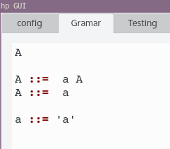
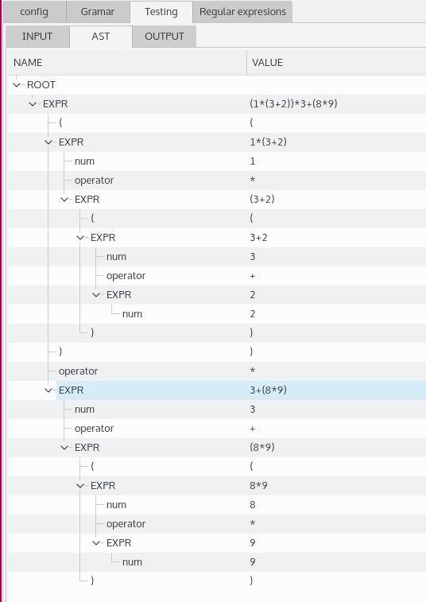
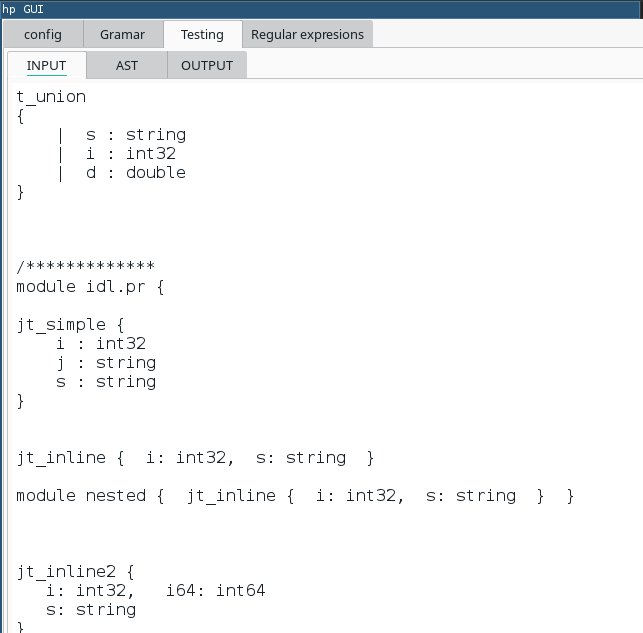
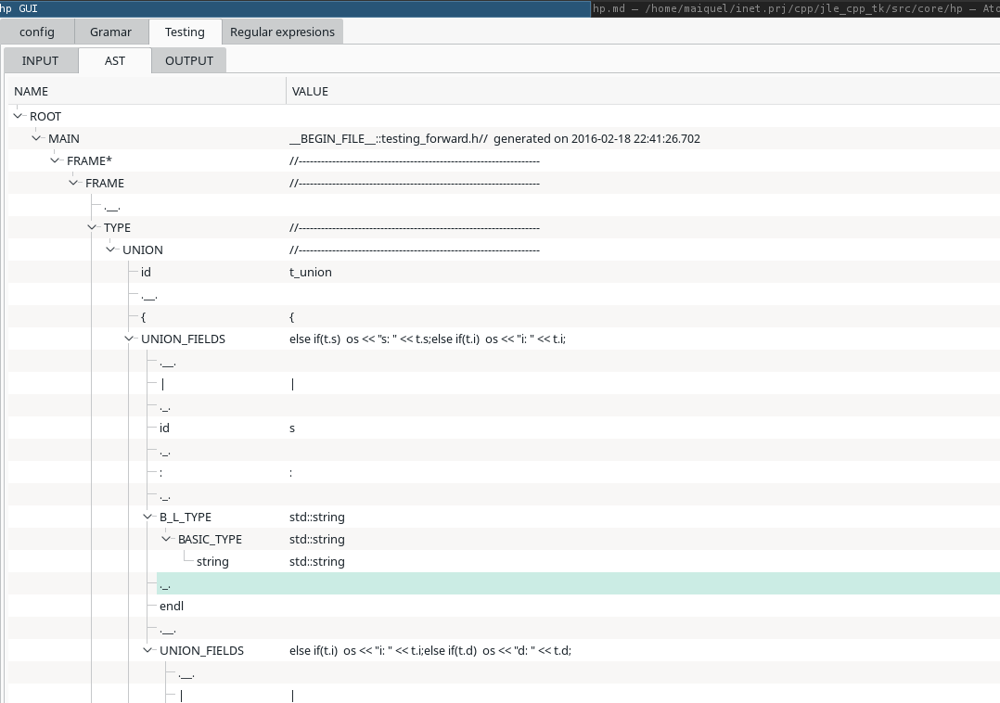
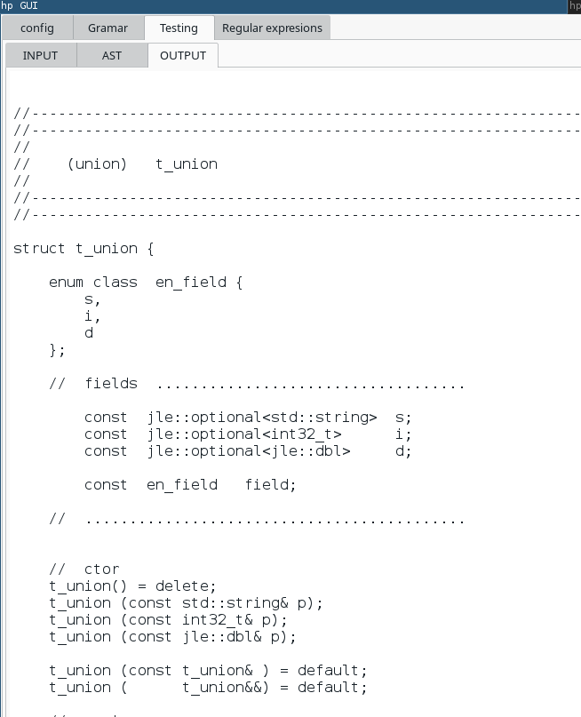

# hp & AST


Full example on examples/project/idl


## Aim

Enjoy!

A parser is an important tool for a programmer.

I'm also interested on *methaprograming*. One one to do it, and sometimes
the only correct one, is creating *DSLs*.

In most cases, these *DSLs* has to be external. Working with external *DSLs*
give you full freedom.


## Tools

On `tools` folder we have *hpt* binary. It works with hp and *AST* to process inputs with grammars and generates files.

On `tools/qt` we have a small *ui* to work with grammars and templates


## Main actors

### hp

This is a simple LL(n) parser.

With it we can validate inputs with a specific grammar.

This is dynamic, therefore not fast.

It will create an *AST*


### AST

As a result of parsing a file with a grammar, an *AST* will
be generated.

We can process this *AST* with a *c++* program, or we can use the *templates*
transformation.


### Templates

A template is a piece of text with functions calls.

These functions will transform the parameters, create variables and they also
will return a *template*


## Defining a grammar


### Basic grammars

Let's start with a common and simple exercise, parsing a math equation.

Lets start with hello world on grammars...



This grammar, accepts one or several 'a' char. Simple.

The first line, defines the initial *non terminal* symbol

**NON Terminal symbols** will be on upper case

**Terminal symbols** will be on lower case

As you can see, it derives by left.

Now, let's have a sequence of 'a' followed by 'b' and a sequence of 'a' again
Lets try next one, parenthesis...

It has to accept things like...

~~~~~~~
abaaa
aaaabaa
aba
~~~~~~~

~~~~~~~
B

B ::= A  b  A

A ::= a A
A ::= a

a ::= 'a'
b ::= 'b'
~~~~~~~
Great.


But now, we want same quantity of 'a' at the beginning and at the end.

It has to accept things like...

~~~~~~~
aaabaaa
aaaabaaa
aba
~~~~~~~

But not...

~~~~~~~
aabaaa
aaaaba
ab
~~~~~~~
Let's try

~~~~~~~
B

B ::= a  b  a
B ::= aa  b  aa
B ::= aaa  b  aaa


a ::= 'a'
b ::= 'b'
aa ::= 'aa'
aaa ::= 'aaa'
~~~~~~~

From now on, lasts lines will indicate a valid input, rest of lines will be the grammar

This is not a full solution, and it's not an elegant one either.

~~~~~~~
B

B ::= a  B  a
B ::= b

a ::= 'a'
b ::= 'b'

input: aaabaaa
input: aba
~~~~~~~

This looks great. Generic, concise, simple.

We can move it to parenthesis...

~~~~~~~
B

B ::= ( B )
B ::= b

b ::= 'b'
( ::= '('
) ::= ')'

input: (((b)))
input: (b)
~~~~~~~

### Expressions grammar

Let's start with numbers.

~~~~~~~
EXPR

EXPR ::=  NUM

NUM  ::=  d NUM
NUM  ::=  d

d ::= ([0-9])
input: 123456
~~~~~~~

Terminal symbols can be defined as *regular expressions* in order to simplify the rule.

To keep the example simple, we will let numbers of any size and just integers.

If terminal symbols can be written as *regular expressions*, then we can simplify...

~~~~~~~
EXPR

EXPR ::=  num

num ::= ([0-9]+)

input: 123456
~~~~~~~

Added one operator
~~~~~~~
EXPR

EXPR ::=  num operator num

num ::= ([0-9]+)
operator ::= ([\+|\-|\*|\/])

input: 1+2
~~~~~~~

But expressions has to accept multiple operators and numbers...

~~~~~~~
EXPR

EXPR ::=  num operator EXPR
EXPR ::=  num

num ::= ([0-9]+)
operator ::= ([\+|\-|\*|\/])

input: 1+2*3
~~~~~~~


And what about the parenthesis?...
~~~~~~~
EXPR

EXPR ::=  ( EXPR ) operator EXPR
EXPR ::=  ( EXPR )
EXPR ::=  num operator EXPR
EXPR ::=  num

num      ::= ([0-9]+)
operator ::= ([\+|\-|\*|\/])
(        ::= '('
)        ::= ')'

input: (1+2)*3
input: (1*(3+2))*3+(8*9)
~~~~~~~

We could want to let spaces between elements.

~~~~~~~
EXPR

EXPR ::=  _ ( _ EXPR _ ) _ operator _ EXPR
EXPR ::=  ( _ EXPR _ )
EXPR ::=  num _ operator _ EXPR
EXPR ::=  num

num      ::= ([0-9]+)
operator ::= ([\+|\-|\*|\/])
(        ::= '('
)        ::= ')'
_        ::= ([ |\t]*)

input: ( 1+2 ) *3
input: (1* (3  +2 ) )* 3+( 8* 9  )
~~~~~~~

This grammar will produce next tree for entrance ```(1* (3  +2 ) )* 3+( 8* 9  )```



Fantastic, but, what if we want to consider operator priority?...

Here it is...

~~~~~~~
EXPR

EXPR    ::=    _ unaryoperator _ ADDS _
EXPR    ::=    ADDS
ADDS    ::=    FACTS _ add_operator _ ADDS
ADDS    ::=    FACTS
FACTS   ::=    VAL _ mult_operator _ ADDS
FACTS   ::=    VAL

VAL     ::=    FUNC _ ( _ EXPR _ )
VAL     ::=    _ num
VAL     ::=    VAR
VAR     ::=    _ id
FUNC    ::=    _ id

FACTS   ::=    _ ( _ EXPR _ )


num           ::=    ([0-9]+)
id            ::=    ([a-z|A-Z][0-9|a-z|A-Z|_]*)
id            ::=    (_+[0-9|a-z|A-Z]+[0-9|a-z|A-Z|_]*)
mult_operator ::=    ([\*|\\])
add_operator  ::=    ([\+|\-])
unaryoperator ::=    ([\+|\-])
_             ::=    ([ |\t]*)
(             ::=    (\()
)             ::=    (\))
~~~~~~~

And here is the tree with correct priority for input ```1+2*3```...


### terminal especial rules

* Predefined constants
  * \__any\__ -> any value
  * \__isalpha\__ -> letter
  * \__islower\__
  * \__isupper\__
  * \__isdigit\__
  * \__isalnum\__
  * \__endl\__
  * \__isspace\__
  * \__isspace*\__  -> zero or more spaces
  * \__isspace+\__  -> one or more spaces
  * \__space_tab\__ -> space or tab
  * All the constants can be negated with **!**
* Regular expressions
  * It will be rounded by parenthesis
* Literals
  * Marked with **'**
* Klein star
  * If the rule finished with __*__, it will be processed as a Klein star

### Non terminal especial rules

* Klein star
  * If the rule finished with __*__, it will be processed as a Klein star


## Transforming text

Validating files is quite interesting.

Parsing files and generating *AST* is even better.

Once you have the *AST*, you can do things depending of the input file.

Great!!!!

But many times, the result will be text, perhaps, another file.

Even when is not the case, generating a normalized text is an interesting option (some times a very good one) to process the input.

Generating *DSLs* is a good example.

That's the main reason why I build this lib, and in these cases, the game consists
on getting a text, validate it, and generating a different text.

The output could be also... a program in bytecode or c++, or embedded language.

Yes! this is external DSL

Lets see one example with the expression grammar.

Look to ```##transf2->```

```
MAIN

MAIN ::= EXPR

EXPR    ::=    _ VAR _ = _ EXPR                                 ##transf2-> $(EXPR)$(__endl__)copy2:$(VAR)
EXPR    ::=    _ VAL _ EXPR'                                    ##transf2-> $(VAL)$(__endl__)$(EXPR')
EXPR    ::=    _ unaryoperator VAL _ EXPR'                      ##transf2-> $(VAL)$(__endl__)$(unaryoperator)$(__endl__)$(EXPR')
EXPR    ::=    _ ( _ EXPR _ ) _ EXPR'                           ##transf2-> $(EXPR)$(__endl__)$(EXPR')
EXPR    ::=    _ unaryoperator ( _ EXPR _ ) _ EXPR'             ##transf2-> $(EXPR)$(__endl__)$(unaryoperator)$(__endl__)$(EXPR')
EXPR'   ::=    POWER
EXPR'   ::=    FACTOR
EXPR'   ::=    SUM

POWER   ::=    _ powerop _ VAL _ POWER                          ##transf2-> $(VAL)$(__endl__)$(POWER)$(__endl__)$(powerop)
POWER   ::=    _ powerop _ VAL _ FACTOR                         ##transf2-> $(VAL)$(__endl__)$(powerop)$(__endl__)$(FACTOR)
POWER   ::=    _ powerop _ VAL _ SUM                            ##transf2-> $(VAL)$(__endl__)$(powerop)$(__endl__)$(SUM)
POWER   ::=    _ powerop _ ( _ EXPR _ ) _ EXPR'                 ##transf2-> $(EXPR)$(__endl__)$(mult_operator)$(__endl__)$(EXPR')

FACTOR  ::=    _ mult_operator _ VAL _ POWER                    ##transf2-> $(VAL)$(__endl__)$(POWER)$(__endl__)$(mult_operator)
FACTOR  ::=    _ mult_operator _ VAL _ FACTOR                   ##transf2-> $(VAL)$(__endl__)$(mult_operator)$(__endl__)$(FACTOR)
FACTOR  ::=    _ mult_operator _ VAL _ SUM                      ##transf2-> $(VAL)$(__endl__)$(mult_operator)$(__endl__)$(SUM)
FACTOR  ::=    _ mult_operator _ ( _ EXPR _ ) _ EXPR'           ##transf2-> $(EXPR)$(__endl__)$(mult_operator)$(__endl__)$(EXPR')

SUM     ::=    _ add_operator _ VAL _ POWER                     ##transf2-> $(VAL)$(__endl__)$(POWER)$(__endl__)$(add_operator)
SUM     ::=    _ add_operator _ VAL _ FACTOR                    ##transf2-> $(VAL)$(__endl__)$(FACTOR)$(__endl__)$(add_operator)
SUM     ::=    _ add_operator _ VAL _ SUM                       ##transf2-> $(VAL)$(__endl__)$(add_operator)$(__endl__)$(SUM)
SUM     ::=    _ add_operator _ ( _ EXPR _ ) _ EXPR'            ##transf2-> $(EXPR)$(__endl__)$(add_operator)$(__endl__)$(EXPR')
SUM     ::=    _                 

VAL     ::=    FUNC _ ( _ EXPR _ ) _                            ##transf2-> $(EXPR)fun/1:$(FUNC)
VAL     ::=    FUNC _ ( _ EXPR _ , _ EXPR _ ) _                 ##transf2-> $(EXPR)$(__endl__)$(EXPR#1)fun/2:$(FUNC)

VAL     ::=    num                            
VAL     ::=    VAR                              
VAR     ::=    id                                               ##transf2-> var:$(id)
FUNC    ::=    id                             

num           ::=    ([0-9]*\.[0-9]+)                           ##transf2-> num:$(t)
num           ::=    ([0-9]+\.[0-9]*)                           ##transf2-> num:$(t)
num           ::=    ([0-9]+)                                   ##transf2-> num:$(t)
id            ::=    ([a-z|A-Z][0-9|a-z|A-Z|_]*)  
id            ::=    (_+[0-9|a-z|A-Z]+[0-9|a-z|A-Z|_]*)
powerop       ::=    (\^)                                      ##transf2-> fun/2:$(t)
mult_operator ::=    ([\*|\/])                                 ##transf2-> fun/2:$(t)
add_operator  ::=    ([\+|\-])                                 ##transf2-> fun/2:$(t)
unaryoperator ::=    ([\+|\-])                                 ##transf2-> fun/1:$(t)
_             ::=    ([ |\t]*)                                 ##transf2-> $(__nothing__)
(             ::=    (\()                        
)             ::=    (\))                        
,             ::=    (,)                          
=             ::=    (=)                          
```

Very simple. You can generate an output for the subtree, using *vars* to refer the information on AST, and some predefined vars


And it will generate for input ```1+2*3 +(7/9*5) +1```...

```
num:1
num:2
num:3
fun/2:*
num:7
num:9
fun/2:/
num:5
fun/2:*

fun/2:+
num:1
fun/2:+

fun/2:+
```

A small program, easy to process

You can see a example [here](https://github.com/jleahred/jle_cpp_tk/tree/master/examples/project/calculator)

This is a simple calculator, with vars, functions (extensible), operator priority...

* Predefined vars
  * \__endl\__
  * \__space\__
  * \__dollar_open_par\__
  * \__close_par\__
  * \__counter\__


### Beyond

When you need to work with complex transformation rules, you can define them outside the grammar rule.

```
[...]
EXPR    ::=    _ VAR _ = _ EXPR                                 ##transf2-> $(EXPR_TPL)

[...]

__BEGIN_TEMPLATE__:: EXPR_TPL

copy2:$(VAR)
__END_TEMPLATE__::
```

You can also define vars to be used as functions (a kind of macro system).

Let see an example from *idl*

```
MAIN   ::=  FRAME*               ##transf2->$(GENERATE_CODE)


__BEGIN_TEMPLATE__:: GENERATE_CODE
$(__set__ FRAME_TYPE
~    $(__set__ TYPE_OPTIONAL          jle::optional<$(BASIC_TYPE)>)~
~    $(__set__ TYPE_RECOMENDED        jle::optional<$(BASIC_TYPE)>)~
~    $(__set__ TYPE_LIST              jle::list<$(BASIC_TYPE)>)~
~    $(__set__ TYPE_WITH_DEFAULT_DATE $(BASIC_TYPE))~
~    $(__set__ TYPE_WITH_DEFAULT      $(BASIC_TYPE))~
~    $(__set__ COMP_TYPE_NO_END       $(id)::$(COMPOSED_TYPE))~
~    $(__set__ COMP_TYPE_END          $(id))~
~    $(__run__)~
~    $(TYPE))~
~
$(H_FORWARD_FILE)
$(H_FILE)
$(CPP_FILE)
__END_TEMPLATE__::
```

*$(GENERATE_CODE)* will write the template content as expected.

```
$(__set__ ...
```

is a function. In this case, when **FRAME_TYPE** will be reached, it will be replaced by a lot of new **\__set\__**, a **\__run\__** and **$(TYPE)**

The **~** symbol at the beginning of the line, means... *ignore spaces*. And same symbol at the end, means, remove new line.

This lets us to redefine vars, and even define vars with vars inside. When AST is processed, the vars will be replaced by their value. If the value contains vars, the will be replaced by value again, and so...

Once we have declared vars, could be necessary to run again the subtree in order to apply the new defined values. This is done with **\__run\__** function

Functions, starts with **$(** and ends with **)**

* Defined functions
  * $(VAR_NAME) -> this is a special implicit function it's equivalent to **get \__VAR_NAME\__**
  * \__ident+\__ -> increase identation
  * \__ident-\__
  * \__date_time\__
  * \__date\__
  * \__run\__ -> run again subtree applying current vars
  * \__prune\__
  * \__nothing\__
  * \__set\__
  * \__copy\__
  * \__alignc\__
  * \__lmargin\__

This is a declarative language and inmutable.

In some cases, inmutability will require too much computation and complex code. For example, creating a counter.

To deal with these situations (just as exceptions), next mutable functions are provided...

  * \__set_mut\__
  * \__get_mut\__
  * \__inc\__
  * \__dec\__


Lets go back to the *idl* example...

```
MAIN   ::=  FRAME*               ##transf2->$(GENERATE_CODE)


__BEGIN_TEMPLATE__:: GENERATE_CODE
$(__set__ FRAME_TYPE
~    $(__set__ TYPE_OPTIONAL          jle::optional<$(BASIC_TYPE)>)~
~    $(__set__ TYPE_RECOMENDED        jle::optional<$(BASIC_TYPE)>)~
~    $(__set__ TYPE_LIST              jle::list<$(BASIC_TYPE)>)~
~    $(__set__ TYPE_WITH_DEFAULT_DATE $(BASIC_TYPE))~
~    $(__set__ TYPE_WITH_DEFAULT      $(BASIC_TYPE))~
~    $(__set__ COMP_TYPE_NO_END       $(id)::$(COMPOSED_TYPE))~
~    $(__set__ COMP_TYPE_END          $(id))~
~    $(__run__)~
~    $(TYPE))~
~
$(H_FORWARD_FILE)
$(H_FILE)
$(CPP_FILE)
__END_TEMPLATE__::
```

Once the *AST* is ready, we will run it in order to generate the output.

In this case, **$(GENERATE_CODE)** will be replaced by the template content bellow.

Processing it, will declarate a variable **FRAME_TYPE**, will add the content of forward, h and cpp files...

```
MAIN   ::=  FRAME*               ##transf2->$(GENERATE_CODE)


__BEGIN_TEMPLATE__:: GENERATE_CODE
$(__set__ FRAME_TYPE [...])
~
$(H_FORWARD_FILE)
$(H_FILE)
$(CPP_FILE)
__END_TEMPLATE__::
```


Let's see the **H_FILE**

```
__BEGIN_TEMPLATE__:: H_FILE
__BEGIN_FILE__::$(__file_name__).h
//  generated on $(__date_time__)


#include <cstdint>
#include <string>
#include "core/tuple.hpp"
#include "core/optional.hpp"
#include "core/dbl.h"
#include "core/cont/list.hpp"


$(__set__  MODULE      $(MODULE_CODE))~
$(__set__  RECORD      $(RECORD_H))~
$(__set__  TUPLE       $(TUPLE_H))~
$(__set__  ENUMERATION $(ENUMERATION_H))~
$(__set__  UNION       $(UNION_H))~
$(__run__)

$(FRAME*)
$(__endl__)$(__endl__)$(__endl__)
__END_TEMPLATE__::
```

It writes some text, declare some vars and will write **$(FRAME*)**


One example with counters...

```
__BEGIN_TEMPLATE__:: COUNT_TUPLE_FIELDS
$(__nothing__     count number of fields)~
$(__set_mut__  PCOUNTER  0)~
$(__set__  F_NO_NAMED_NOEND $(__inc__ PCOUNTER)$(F_NO_NAMED))~
$(__set__  F_NO_NAMED_END   $(__nothing__))~
$(__run__)~
__END_TEMPLATE__::

[...]

$(COUNT_TUPLE_FIELDS)~
$(__nothing__     write fields with counter)~
$(__set__  F_NO_NAMED_NOEND $(FULL_TYPE) p$(__get_mut__ PCOUNTER)$(__dec__ PCOUNTER),$(__endl__)$(F_NO_NAMED))~
$(__set__  F_NO_NAMED_END $(FULL_TYPE) p$(__get_mut__ PCOUNTER)$(__dec__ PCOUNTER))~
$(__run__)

```

You can see a complete example here [idl](https://github.com/jleahred/jle_cpp_tk/tree/master/examples/project/idl)


## Tooling

Great, we have a LL(n) parser, with rules and templates to generate an output.

### Grammar and templates processor

This has been used to create [hpt](https://github.com/jleahred/jle_cpp_tk/tree/master/tools/hpt)

This is a small program who lets us to define the input files, and grammar with template files.

It will run all, and will produce the result.

### Grammar and template editor

[hpgui](https://github.com/jleahred/jle_cpp_tk/tree/master/tools/qt/hpgui)

This is a simple Qt program who helps us to write grammars, templates and debug it

You can work with several grammars and choose the proper one.


You can edit the grammar and templates


You can edit the input



You can edit show the tree with transformations applied




You can show the output


